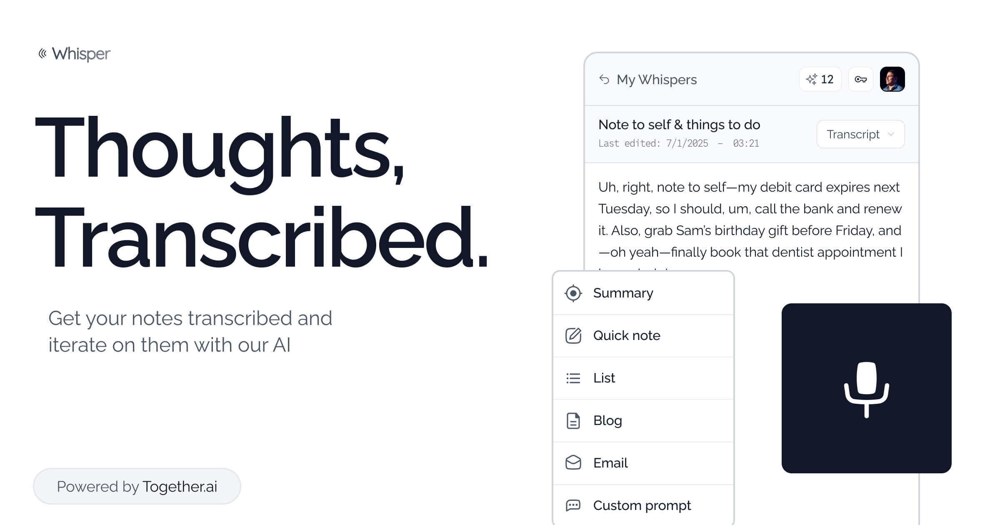

<a href="https://github.com/nutlope/whisper-app">
  
  <h1 align="center">Whisper App</h1>
</a>

  An open source audio transcription and transformation app. Powered by Together.ai.

## Tech stack

- Together.ai for LLM-powered audio transcription and transformation
- Vercel's AI SDK as the LLM framework
- Clerk for authentication
- Neon for postgres
- Next.js App Router
- S3 for object storage (audio files)
- Upstash Redis for rate limiting
- Prisma for ORM
- Vercel for hosting

## How it works

1. Create an account on the site with Clerk
2. Upload an audio file, which gets uploaded to S3
3. The audio is transcribed using Together.ai's Whisper model
4. Optionally, transform the transcription using LLMs (summarize, extract, etc.)
5. View and manage your transcriptions in your dashboard

## Cloning & running

1. Fork or clone the repo
2. Create an account at [Together AI](https://togetherai.link) for the LLM
3. Create an account at [Upstash](https://upstash.com/) for Redis
4. Create an account at [AWS](https://aws.amazon.com/) for S3
5. Create an account at [Neon](https://neon.com/) for the DB
6. Create a Clerk account at [Clerk](https://clerk.com/) for authentication
7. Create a `.env` file (use `.example.env` for reference) and add your API keys
8. Run `pnpm install` and `pnpm run dev` to install dependencies and start the app locally
